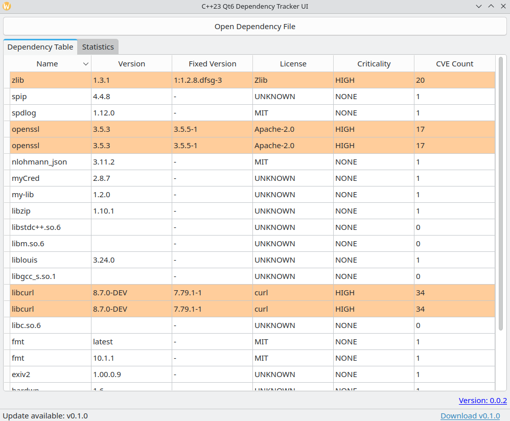
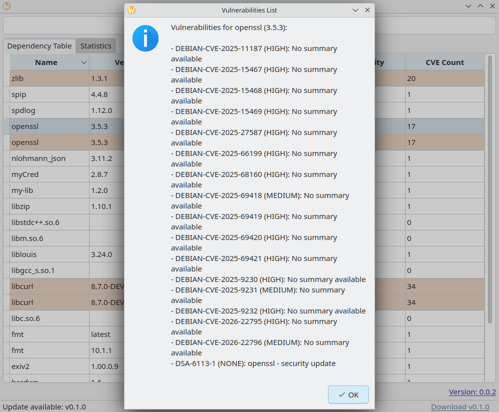
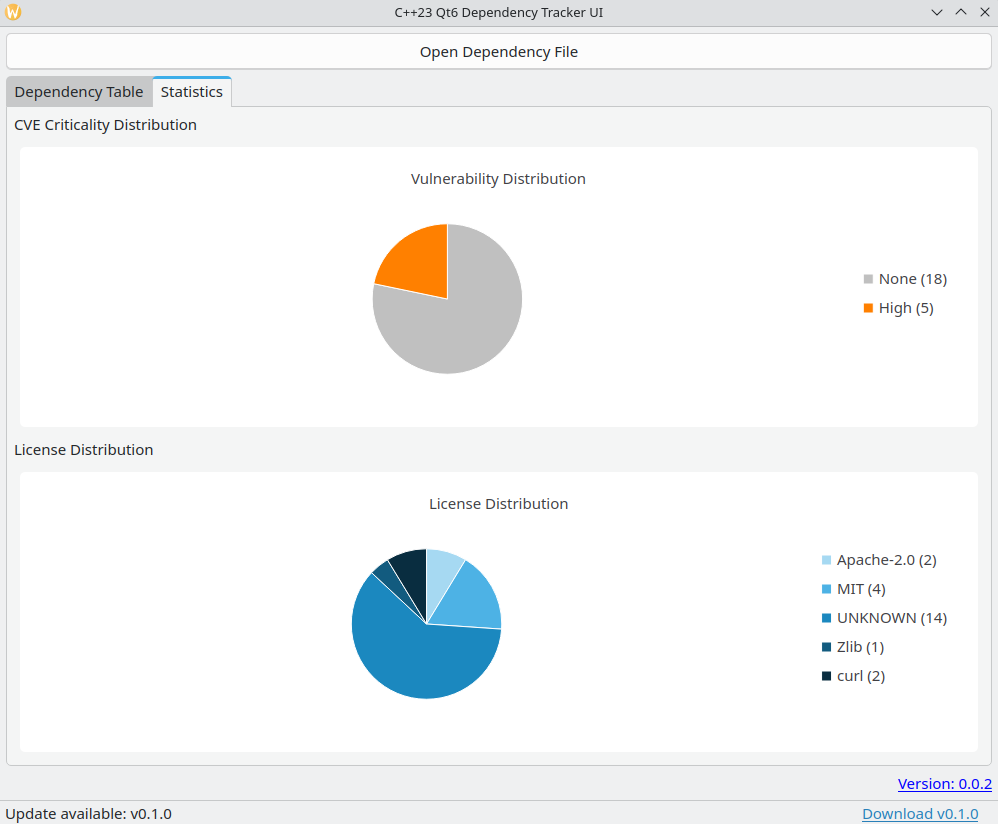

# Qt Dependency Tracker UI

A modern C++23 Qt6 application for tracking and visualizing software dependencies and their vulnerabilities.

## Features

- **Multi-Format Support**: Load CycloneDX (JSON), SPDX (Tag-Value), and custom DepDiscover files via a file dialog.
- **Enhanced Dependency Table**:
  - **Sortable Columns**: Sort by Name, Version, Fixed Version, License, Criticality, or CVE Count.
  - **Color-Coding**: Rows are color-coded based on the highest CVE criticality (Critical, High, Medium, Low, None/Unknown).
  - **Interactive Criticality**: Click on the "Criticality" cell to open the NVD/OSV detail page for the most severe vulnerability.
  - **CVE Details**: Click on "CVE Count" to see a full list of vulnerabilities for that dependency.
  - **Fixed Version Detection**: Automatically identifies the version where vulnerabilities are fixed (if available in the source file).
- **Comprehensive Statistics**:
  - **Vulnerability Distribution**: Pie chart showing the breakdown of components by their maximum criticality.
  - **License Distribution**: Visualization of different licenses used across all project dependencies.
- **GitHub Update Checker**: Automatically checks for new versions of this application on GitHub at startup.
- **Modern C++23**: Leverages C++23 standards, including `std::expected`, `std::filesystem`, and modern syntax.

## Screenshots







**see also**:

- [Architecture Document](docs/architecture/architecture.md)
- [depdiscover](https://github.com/Zheng-Bote/depdiscover)

## Architecture

The project follows a robust Model-View-Controller (MVC) like architecture. Detailed documentation and diagrams can be found in the [Architecture Document](docs/architecture/architecture.md).

## Build Instructions

### Prerequisites

- **CMake 3.28+**
- **Qt6 SDK** (Core, Widgets, Gui, Charts, Network, Concurrent)
- **C++23 compatible compiler** (GCC 13+, Clang 16+, or MSVC 19.34+)
- **Git** (for FetchContent dependencies)

### Steps

1. Create a build directory:
   ```bash
   mkdir build && cd build
   ```
2. Configure the project:
   ```bash
   cmake ..
   ```
3. Build the application:
   ```bash
   make -j$(nproc)
   ```
4. Run the application:
   ```bash
   ./QtDependencyTrackerUI
   ```

## Usage

1. **Start**: Launch the application. An update check will run silently in the background.
2. **Load**: Click **"Open Dependency File"** and select a supported SBOM or scanning result.
3. **Analyze**: Use the **"Dependency Table"** to sort and identify risks. Click on cells for more info.
4. **Visualize**: Switch to the **"Statistics"** tab for high-level insights.
5. **Update**: If a new version is available, a link will appear in the status bar.

## License

This project is licensed under the MIT License - see the `LICENSE` file (if available) or header comments for details.
