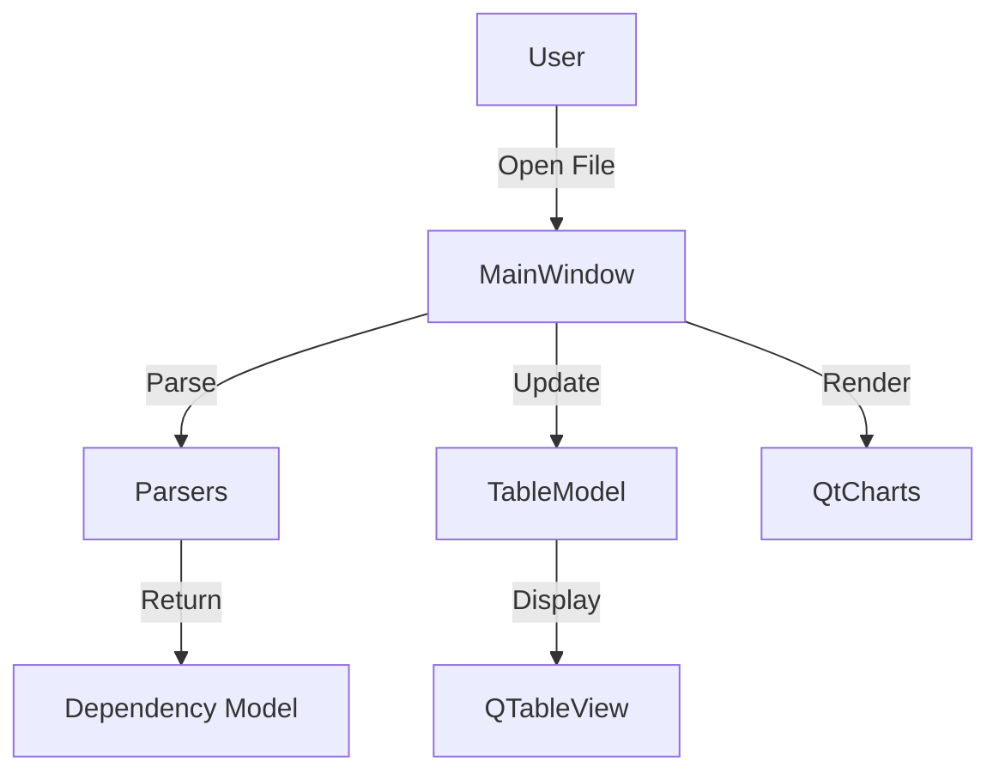

# Qt Dependency Tracker UI

A modern C++23 Qt6 application for tracking, visualizing, and exporting software dependencies and their vulnerabilities.

[](https://opensource.org/licenses/MIT)

[](https://github.com/Zheng-Bote/qt_depdiscover_ui/releases)

[Report Issue](https://github.com/Zheng-Bote/qt_depdiscover_ui/issues) · [Request Feature](https://github.com/Zheng-Bote/qt_depdiscover_ui/pulls)

---

<!-- START doctoc generated TOC please keep comment here to allow auto update -->
<!-- DON'T EDIT THIS SECTION, INSTEAD RE-RUN doctoc TO UPDATE -->

**Table of Contents**

- [Qt Dependency Tracker UI](#qt-dependency-tracker-ui)
  - [Description](#description)
  - [🚀 Features](#-features)
  - [📸 Screenshots](#-screenshots)
  - [🏗 Architecture](#-architecture)
  - [🏗 Build Instructions](#-build-instructions)
    - [Prerequisites](#prerequisites)
    - [Steps](#steps)
  - [📚 Usage](#-usage)
  - [📜 License](#-license)
  - [📝 Author](#-author)
  - [📝 Code Contributors](#-code-contributors)

<!-- END doctoc generated TOC please keep comment here to allow auto update -->

---

## Description


Qt Dependency Tracker UI is a modern C++23 Qt6 application for tracking, visualizing, and exporting software dependencies and their vulnerabilities.

## 🚀 Features

- **Multi-Format Import**: Load CycloneDX (JSON), SPDX (Tag-Value), and custom DepDiscover files via a file dialog. Features robust parsing, including whitespace handling for SPDX and intelligent CVSS score extraction.
- **CycloneDX Export**: Convert loaded dependencies (from any supported format) into a standardized CycloneDX 1.4 JSON file for use in enterprise security dashboards.
- **Enhanced Dependency Table**:
  - **Sortable Columns**: Sort by Name, Version, Fixed Version, License, Criticality, or CVE Count.
  - **Color-Coding**: Rows are color-coded based on the highest CVE criticality (Critical, High, Medium, Low, None/Unknown).
  - **Interactive Criticality**: Click on the "Criticality" cell to open the NVD/OSV detail page for the most severe vulnerability.
  - **CVE Details**: Click on "CVE Count" to see a full list of vulnerabilities for that dependency.
  - **Fixed Version Detection**: Automatically identifies the version where vulnerabilities are fixed (if available in the source file).
- **Comprehensive Statistics**:
  - **Vulnerability Distribution**: Pie chart showing the breakdown of components by their maximum criticality.
  - **License Distribution**: Visualization of different licenses used across all project dependencies.
- **GitHub Update Checker**: Automatically checks for new versions of this application on GitHub at startup.
- **Modern C++23**: Leverages C++23 standards, including `std::expected`, `std::filesystem`, and modern syntax.

## 📸 Screenshots

> [!TIP]
> click on the Criticality cell to open the NVD/OSV detail page for the most severe vulnerability.\
> click on the CVE Count cell to see a full list of vulnerabilities for that dependency.


**see also**:

- [Architecture Document](docs/architecture/architecture.md)
- [depdiscover](https://github.com/Zheng-Bote/depdiscover)

## 🏗 Architecture

The project follows a Model-View-Controller (MVC) like architecture to ensure separation of concerns and maintainability.

- **Models**: `Dependency` and `CVE` structures.
- **Views**: Qt-based UI components (`MainWindow`, `DependencyTableModel`).
- **Parsers**: Standardized interfaces for `CycloneDX`, `SPDX`, and `DepDiscover` formats.
- **Controller**: Orchestrated within `MainWindow` to handle events and data flow.



Detailed documentation and diagrams can be found in the [Architecture Document](docs/architecture/architecture.md).

## 🏗 Build Instructions

### Prerequisites

- **CMake 3.28+**
- **Qt6 SDK** (Core, Widgets, Gui, Charts, Network, Concurrent)
- **C++23 compatible compiler** (GCC 13+, Clang 16+, or MSVC 19.34+)
- **Git** (for FetchContent dependencies)

### Steps

1. Create a build directory:
   ```bash
   mkdir build && cd build
   ```
2. Configure the project:
   ```bash
   cmake ..
   ```
3. Build the application:
   ```bash
   make -j$(nproc)
   ```
4. Run the application:
   ```bash
   ./QtDependencyTrackerUI
   ```

## 📚 Usage

1. Start: Launch the application. An update check will run silently in the background.
2. Load: Click "Open Dependency File" and select a supported SBOM or scanning result.
3. Analyze: Use the "Dependency Table" to sort and identify risks. Click on cells for more info.
4. Export: Click "Export CycloneDX SBOM" to save the currently loaded and enriched data into an industry-standard format.
5. Visualize: Switch to the "Statistics" tab for high-level insights.
6. Update: If a new version is available, a link will appear in the status bar.

---

## 📜 License

This project is licensed under the MIT License - see the LICENSE file for details.

Copyright (c) 2026 ZHENG Robert

## 📝 Author

[](https://www.github.com/Zheng-Bote)

## 📝 Code Contributors


---

**Happy checking! 🚀** :vulcan_salute:
