<!--
SPDX-FileComment: Architecture documentation for the dependency tracker UI.
SPDX-FileType: DOCUMENTATION
SPDX-FileContributor: ZHENG Robert
SPDX-FileCopyrightText: 2026 ZHENG Robert
SPDX-License-Identifier: MIT

@file architecture.md
@brief Detailed architecture description and diagrams.
@version 0.2.0
@date 2026-02-22

@author ZHENG Robert (robert@hase-zheng.net)
@copyright Copyright (c) 2026 ZHENG Robert

@license MIT License
-->

# Architecture: Qt Dependency Tracker UI

This project follows a Model-View-Controller (MVC) like architecture to ensure separation of concerns, scalability, and maintainability.

---

<!-- START doctoc generated TOC please keep comment here to allow auto update -->
<!-- DON'T EDIT THIS SECTION, INSTEAD RE-RUN doctoc TO UPDATE -->

**Table of Contents**

- [Architecture: Qt Dependency Tracker UI](#architecture-qt-dependency-tracker-ui)
  - [Component Overview](#component-overview)
  - [Class Diagram](#class-diagram)
  - [Component Diagram](#component-diagram)
  - [Sequence Diagram: Program Start \& Update Check](#sequence-diagram-program-start--update-check)
  - [Sequence Diagram: Data Interaction](#sequence-diagram-data-interaction)
  - [Use Case Diagram](#use-case-diagram)
  - [Activity Diagram: User Workflow](#activity-diagram-user-workflow)
  - [State Machine Diagram](#state-machine-diagram)
  - [Deployment Diagram](#deployment-diagram)

<!-- END doctoc generated TOC please keep comment here to allow auto update -->

---

## Component Overview

- **Models (`models::`)**: Define data structures for `Dependency` and `CVE`.
  - `Dependency`: Contains name, version, fixed version, licenses, and a list of CVEs.
  - `CVE`: Contains ID, description, fixed version, and criticality level (mapped from scores or vectors).
- **Utils (Parsers) (`utils::`)**: Logic for handling different file formats.
  - `IParser`: Interface for all parsers using `std::expected`.
  - `CycloneDXParser`: Standard JSON SBOM support.
  - `SPDXParser`: Support for Tag-Value SPDX files.
  - `DepDiscoverParser`: Custom JSON format support with CVSS vector heuristic.
- **Views (`views::`)**: Qt GUI components.
  - `MainWindow`: Orchestrates the UI and connects logic (acts as a Controller).
  - `DependencyTableModel`: Custom sortable model based on `QAbstractTableModel`.
  - `QtCharts integration`: Native visualization for statistics.
- **External Integration**:
  - `qt_gh_update_checker`: Background update checks via GitHub API.

## Class Diagram

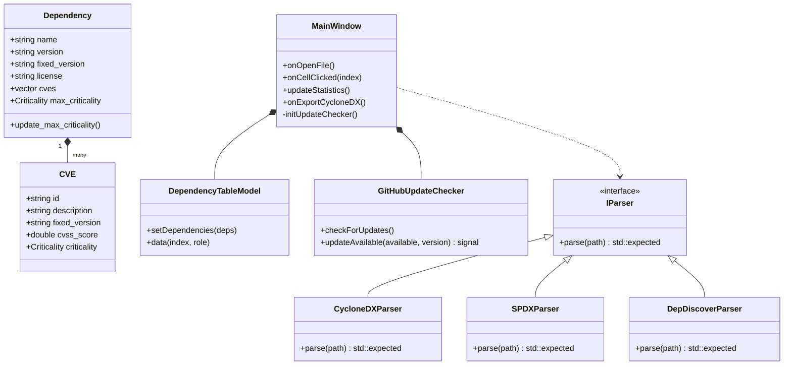

## Component Diagram

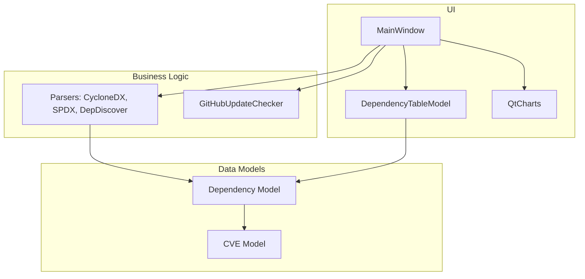

## Sequence Diagram: Program Start & Update Check

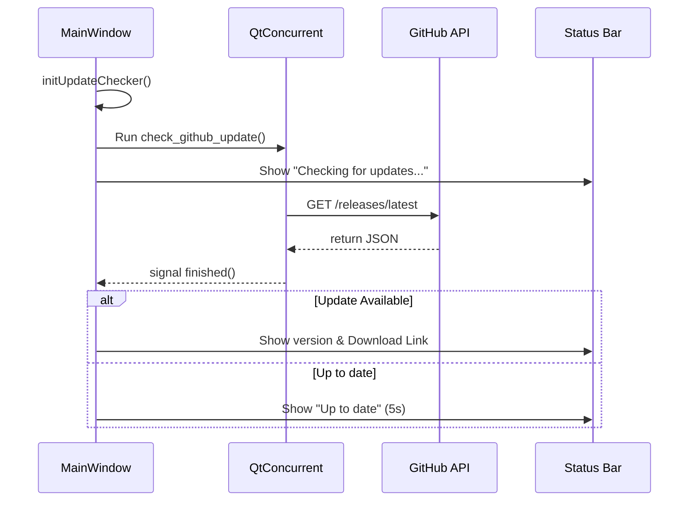

## Sequence Diagram: Data Interaction

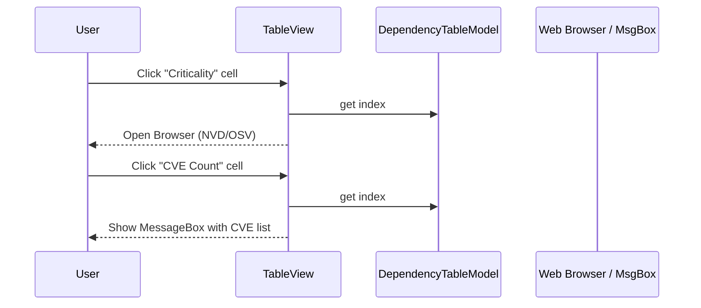

## Use Case Diagram

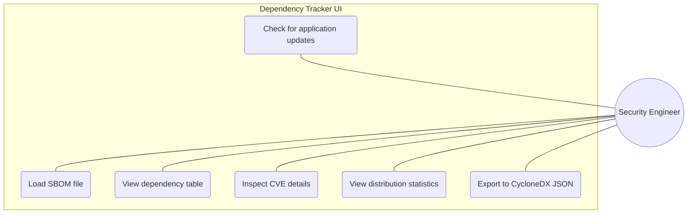

## Activity Diagram: User Workflow

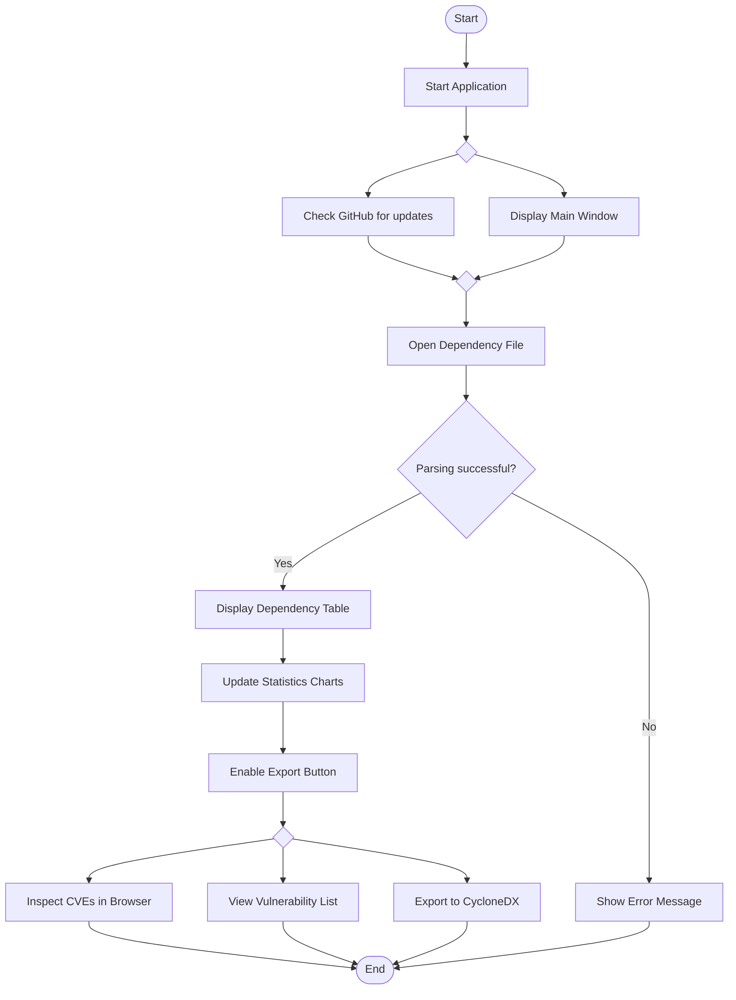

## State Machine Diagram

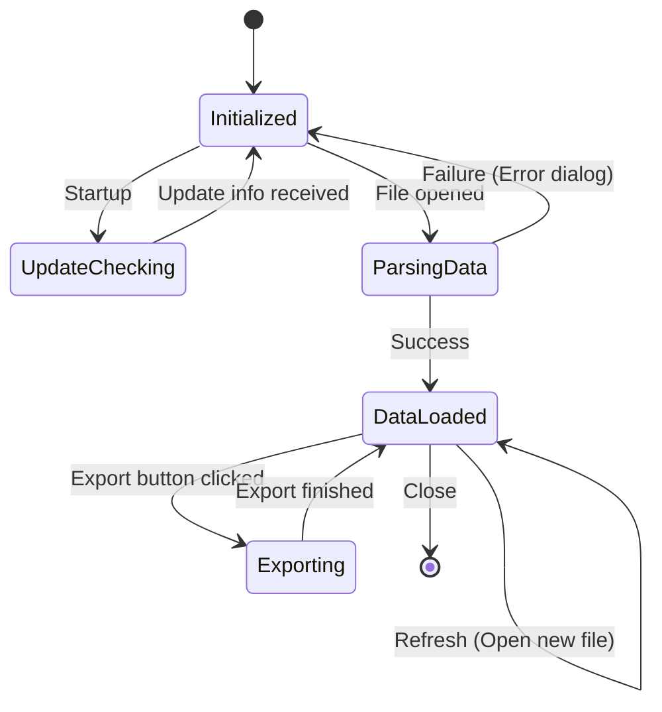

## Deployment Diagram

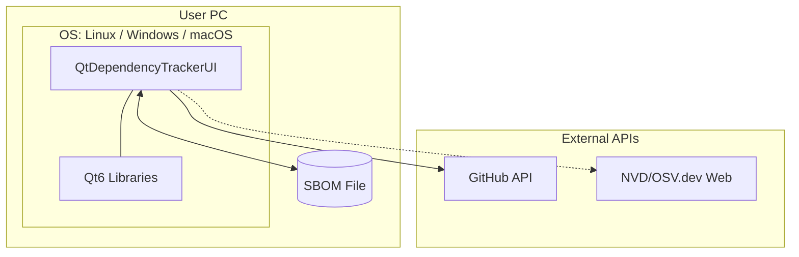

## Object Diagram

Example of objects after loading a simple JSON:

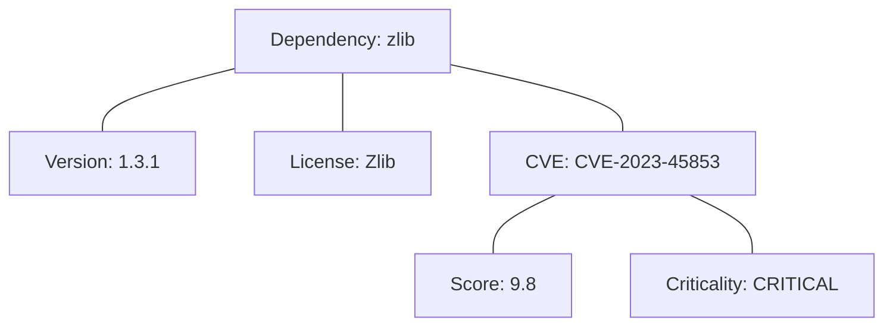

## Package Diagram

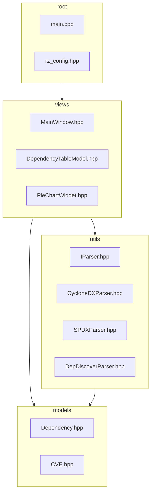

## Timing Diagram: Update Check

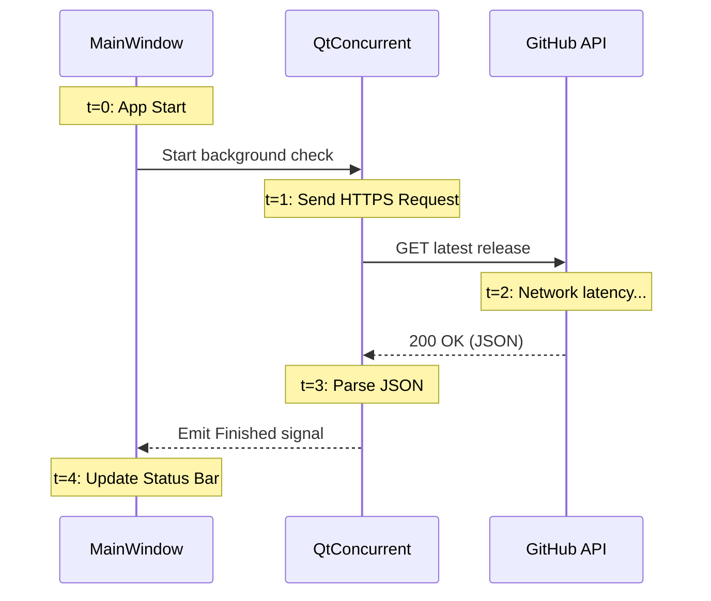

## Communication Diagram: Open File

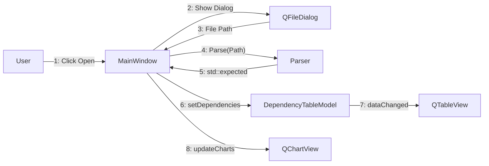

## Interaction Overview Diagram

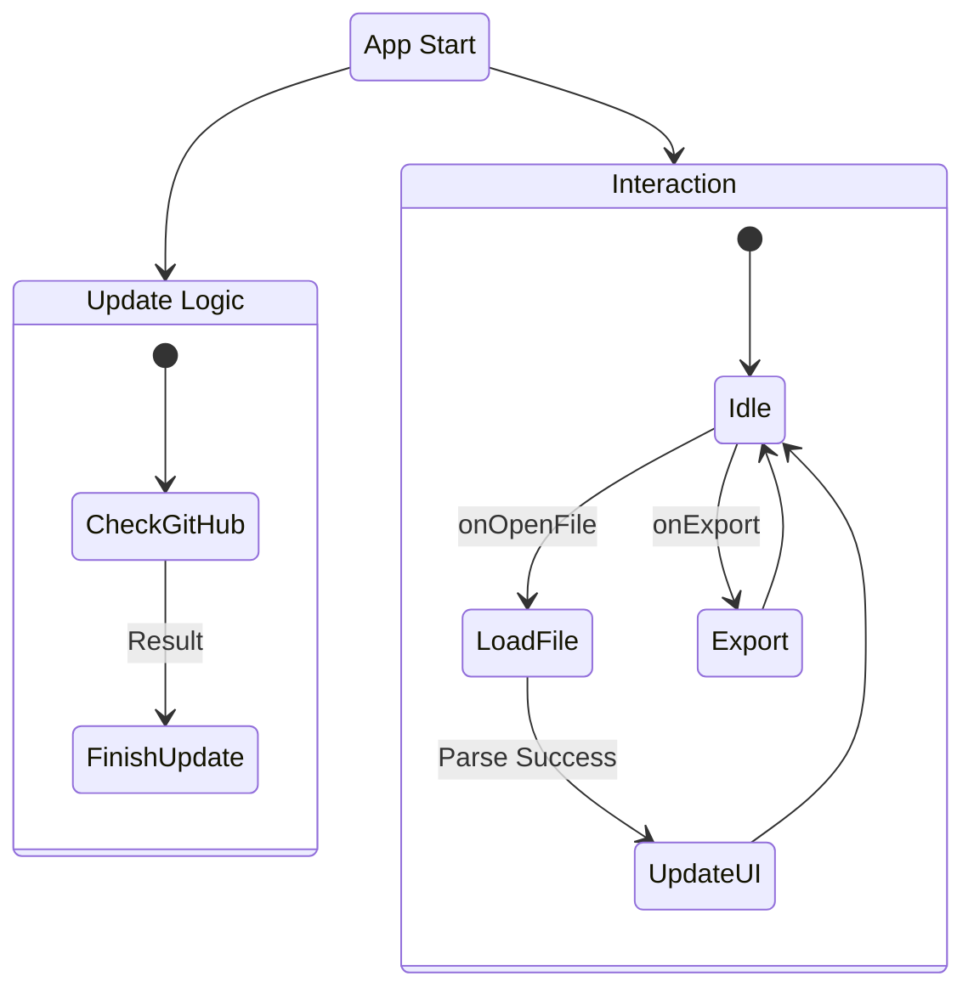

## Profile Diagram (UML Extension)

This diagram shows the stereotypes and extensions used in the project, such as Qt-specific signals/slots and C++23 features.

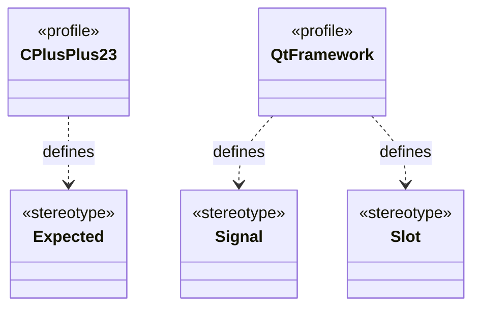
